# Challenge - Ground Lab 02 with Careers@Gov MCP

## Challenge overview

Enhance the original **Resume → Job Fit Evaluator** so attendees can evaluate a
synthetic resume against one explicitly selected Careers@Gov listing.

Complete Modules 2–5 and prove the pasted-JD workflow before starting. All edits
occur in the attendee-generated `PersonalCareerCopilot/src/PersonalCareerCopilot/`
source directory. The starter already contains the prompt contracts, provenance
relays, and failure gate. Attendees complete only two small TODOs in `main.py`.

This is an additive challenge, not a replacement for the original Lab 02:

| Lab 02 path | Job context | Result |
|---|---|---|
| Original | Attendee pastes a job description | Fit score, evidence, gaps, and learning roadmap |
| Careers MCP challenge | Attendee searches, selects one stable job key, and the agent retrieves that exact listing | The same analysis plus verifiable job provenance and dataset context |

The original pasted-job-description path remains available when no selected key
is supplied. This makes the enhancement easy to compare, demonstrate, and
disable if the shared service is unavailable.

**Suggested time:** 15 minutes

**Difficulty:** Beginner

**Primary learning goal:** Connect a provided bounded MCP client to one agent
tool, apply least-privilege tool assignment, and verify grounded output.

## What changes in the agent output?

The original Lab 02 output contains:

1. A structured candidate profile.
2. Structured job requirements.
3. A 100-point fit assessment.
4. Matched, partial, and missing skills.
5. A Microsoft Learn roadmap.

The challenge preserves all of those outputs and adds:

- the exact Careers@Gov job key selected by the attendee;
- the listing title and agency;
- the canonical source URL;
- the trainer snapshot dataset version;
- an explicit evidence trail from job retrieval through the final response.

The final answer should therefore explain both **how well the synthetic candidate
fits** and **which exact source listing was evaluated**.

## Enhanced flow

```mermaid
flowchart LR
    CLI["Learner careers_mcp CLI"] -->|"search_jobs"| MCP["Trainer Careers MCP"]
    MCP --> Cards["Up to five compact job cards"]
    Cards --> Choice["Learner selects one exact job key"]
    Choice --> Input["Synthetic resume + Selected Job Key"]
    Input --> RP["ResumeParser"]
    RP -->|"selected key + parsed resume"| JD["JobDescriptionAgent"]
    JD -->|"get_job once"| MCP
    JD -->|"requirements + source + resume"| Match["MatchingAgent"]
    Match -->|"fit report + source"| Gap["GapAnalyzer"]
    Gap -->|"skill gaps"| Learn["Microsoft Learn MCP"]
    Gap --> Output["Grounded fit report + provenance + roadmap"]

    Pasted["Original pasted JD path"] -.->|"used only when no key exists"| RP
```



### Important boundaries

- Job discovery stays **outside** the hosted agent through the learner CLI.
- The learner, not the model, chooses the listing.
- Only `JobDescriptionAgent` receives the Careers retrieval tool.
- The Careers MCP receives search filters or one exact key—never resume content.
- Retrieved fields are untrusted data and cannot change agent instructions.
- `context_mode="last_agent"` means every required value must be relayed through
  explicit labeled sections.

## Trainer and attendee responsibilities

| Trainer | Attendee |
|---|---|
| Hosts the read-only Careers MCP service | Uses their own Foundry project and model |
| Distributes the endpoint and event key out of band | Stores values only in local `.env` and the azd environment |
| Rotates the shared key before/after the event | Uses only synthetic resume data |
| Monitors availability and keeps the pasted-JD fallback ready | Selects one exact key and verifies provenance |

Attendees do not deploy the Careers dataset, MCP service, trainer Bicep, or
trainer Container App.

## Prerequisites

Complete the base Lab 02 workflow first, then confirm:

- Python 3.13 and the Lab 02 dependencies are installed.
- The attendee can access their own Foundry project and model deployment.
- The trainer has supplied:
  - `CAREERS_MCP_ENDPOINT`;
  - `CAREERS_MCP_API_KEY`.
- `PersonalCareerCopilot/src/PersonalCareerCopilot/.env` is uncommitted and
  contains no placeholders.
- Only synthetic resume content will be used.

## What the starter already provides

The challenge keeps the security-sensitive and orchestration-heavy code in
place so attendees can focus on the MCP integration points.

| Provided component | What it does |
|---|---|
| `careers-main-starter.py` | Supplies the enhanced prompts, tools, provenance relays, and workflow with two focused TODOs |
| `careers_mcp.py` | Owns authentication, MCP transport, input bounds, response validation, and safe errors |
| Agent instructions | Relay the exact selected key, treat job fields as untrusted data, and preserve source provenance |
| `get_selected_careers_job` wrapper | Handles explicit failures and labels successful results as untrusted data |
| [Failure gate](../lab-assets/careers-failure-gate.md) | Verifies the exact tool call and result, then stops before scoring when job context is invalid |
| Workflow wiring | Preserves `context_mode="last_agent"` relays and the conditional stop path |
| `azure.yaml` | Maps the same Careers environment-variable names into the hosted runtime |

Attendees make only these two code changes in `main.py`:

1. Complete `TODO 1` by calling the provided exact-key helper.
2. Complete `TODO 2` by assigning the wrapper tool to `JobDescriptionAgent`.

## Challenge steps

### Step 0 - Install the starter and prove the MCP connection

Run these commands from `PersonalCareerCopilot/src/PersonalCareerCopilot`.
First save the completed base-lab file outside the deployed source folder, then
install the tracked challenge starter and its MCP helper:

```bash
cp main.py ../../main.before-careers.py
cp ../../../lab-assets/careers-main-starter.py main.py
cp ../../../lab-assets/careers_mcp.py .
```

The new `main.py` should contain exactly `TODO 1` and `TODO 2`. The backup keeps
the learner's original pasted-JD implementation available for comparison.

Add the trainer-provided values to the uncommitted `.env` beside `main.py`:

```env
CAREERS_MCP_ENDPOINT=https://<trainer-provided-host>/mcp
CAREERS_MCP_API_KEY=<trainer-provided-event-key>
CAREERS_MCP_TIMEOUT_SECONDS=10
```

```bash
python -m careers_mcp status

python -m careers_mcp search \
  --query "cloud platform engineer" \
  --max-experience-years 5 \
  --limit 3

python -m careers_mcp get \
  --job-key "<one-exact-key-from-search>"
```

Expected results:

1. Dataset status is `ready`.
2. Search returns no more than the requested number of compact job cards.
3. `get` returns the same exact key, canonical URL, and dataset version.
4. Keep one returned `Key:` value for the agent test in Step 3.

If this checkpoint fails, troubleshoot endpoint, key, timeout, or network
configuration before changing agent code.

### Step 1 - Complete TODO 1: call the helper

Open `main.py` and find:

```python
raise NotImplementedError("Complete TODO 1")
```

Replace it with:

```python
payload = await get_careers_job(job_key)
```

This calls the existing helper with only the exact selected key. The surrounding
provided code catches `CareersMcpError`, returns an explicit failure marker, and
labels successful output as untrusted job data.

Do not add raw MCP transport, authentication, job search, or resume data to this
wrapper. Those responsibilities remain inside `careers_mcp.py` or outside the
hosted workflow.

### Step 2 - Complete TODO 2: assign the tool

Find `JobDescriptionAgent` and change:

```python
tools=[],
```

```python
tools=[get_selected_careers_job],
```

Only `JobDescriptionAgent` should receive the Careers tool:

| Agent | Careers tool? | Reason |
|---|---:|---|
| `ResumeParser` | No | Parses and routes learner input |
| `JobDescriptionAgent` | Yes | Retrieves the one selected listing |
| `MatchingAgent` | No | Compares already-grounded profiles |
| `GapAnalyzer` | No | Uses Microsoft Learn MCP for roadmap resources |

Keep `default_options={"store": False}` for all four agents.

### Step 3 - Test the selected and fallback paths

#### Selected Careers listing

```text
Resume:
Synthetic cloud engineer with four years of Python, Terraform, and CI/CD.

Selected Job Key:
<paste-one-exact-key-from-search>
```

#### Original Lab 02 fallback

Start a new request with no `Selected Job Key:` and include:

```text
Resume:
Synthetic application developer with three years of Python and API experience.

Job Description:
<paste a synthetic or public job description>
```

The first request should use Careers MCP. The second should retain the original
Lab 02 behavior without calling Careers MCP.

For a quick failure check, submit a new request with a made-up selected key. The
provided failure gate should return `[WORKFLOW STOP]` without a fit score or
learning roadmap.

## Before hosted deployment

The generated project-root `PersonalCareerCopilot/azure.yaml` already maps the
Careers configuration names into the Hosted Agent runtime. Store the secret in
the attendee's azd environment rather than source code. Run this from the
generated project root:

```bash
bash
read -rsp "Careers MCP key: " CAREERS_KEY && echo
AZURE_DEV_USER_AGENT=microsoft_foundry_skill \
  azd env set CAREERS_MCP_API_KEY "$CAREERS_KEY"
unset CAREERS_KEY
exit
```

Set the non-secret endpoint and timeout in the same azd environment using the
trainer-provided endpoint:

```bash
AZURE_DEV_USER_AGENT=microsoft_foundry_skill \
  azd env set CAREERS_MCP_ENDPOINT "https://<trainer-provided-host>/mcp"
AZURE_DEV_USER_AGENT=microsoft_foundry_skill \
  azd env set CAREERS_MCP_TIMEOUT_SECONDS "10"
```

The workshop key is an opaque shared secret. It has no automatic bearer-token
expiry and remains valid until the trainer rotates it.

Never place the key in:

- `main.py`;
- prompts or agent instructions;
- tool arguments;
- committed `.env` files;
- screenshots or MCP Inspector Network logs.

## Success criteria

- [ ] MCP `status`, `search`, and `get` succeed before the agent test.
- [ ] `TODO 1` calls `await get_careers_job(job_key)`.
- [ ] `TODO 2` assigns the Careers tool only to `JobDescriptionAgent`.
- [ ] The learner explicitly chooses one complete stable key.
- [ ] Exactly one selected listing is retrieved.
- [ ] The same exact key appears in the final response.
- [ ] The final response includes title, agency, source URL, and dataset version.
- [ ] Selected-key data takes precedence when a pasted JD is also present.
- [ ] Invalid/no-input retrieval stops before fit scoring or roadmap generation.
- [ ] Resume content is never sent to Careers MCP.
- [ ] The original pasted-JD path still works.
- [ ] `azure.yaml` contains environment references, not a literal API key.

## Stretch goals

After the base challenge works:

1. Add regression cases for malformed, missing, and conflicting selected keys.
2. Compare the same synthetic resume against two separately selected roles.
3. Add per-attendee APIM subscription keys for individual revocation and usage
   reporting.
4. Replace the shared workshop key with production-grade client authentication.
5. Add a dataset freshness indicator to the final output.

Do not add autonomous job selection, send resume data to the shared service, or
combine multiple listings into one fit score.

## Trainer debrief

Ask attendees:

1. Why is search kept outside the agent?
2. Why can only one agent call `get_job`?
3. What does the stable key contribute beyond a source URL?
4. Why must retrieved job descriptions be treated as untrusted data?
5. What breaks if source metadata is not relayed with `last_agent` context?
6. How does this enhancement preserve the original Lab 02 fallback?

The key lesson is that MCP adds useful external context, while explicit
selection, least-privilege tools, privacy boundaries, and provenance keep the
workflow predictable and auditable.

After completing and testing the challenge, compare your implementation with
[`PersonalCareerCopilotCompleted`](../PersonalCareerCopilotCompleted). Do not use
the completed source as a copy target before attempting the tasks.

---

**Previous:** [Summary & Next Steps](09-summary.md) ·
**Back to:** [Lab 02 Learning Path](README.md)
